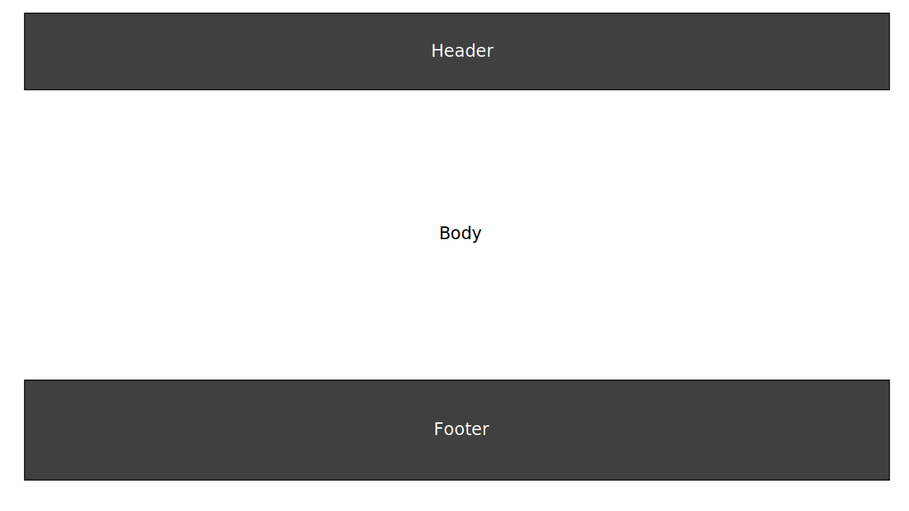
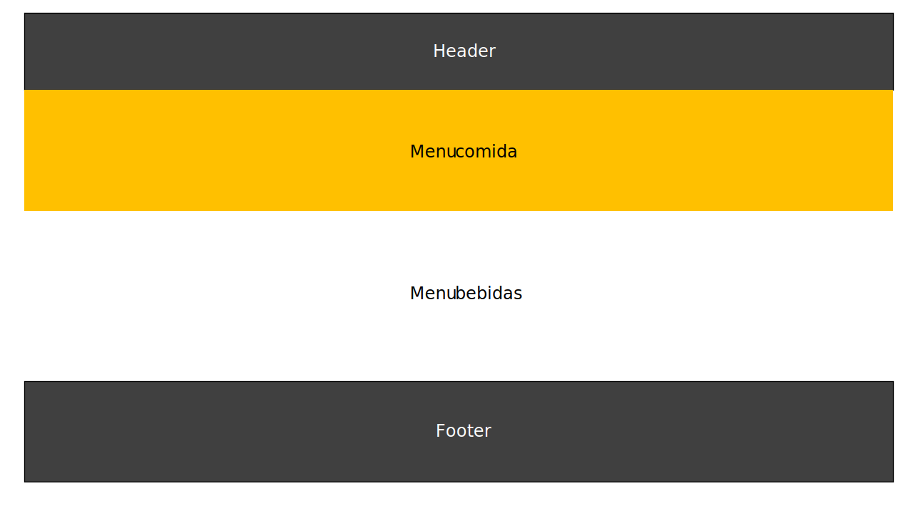
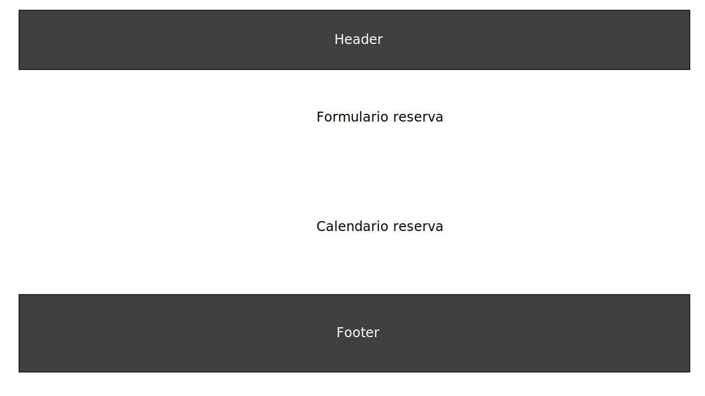

#PROYECTO REACT RESTAURANT

##**INDICE**
*1.-[Prototipado simple](#1.-Intro)
*2.-[Intro](#2.-Intro)
*3.-[Limk](#3.-Link)

##1.- Prototipado simple

##2.- Introducción
Este proyecto corresponde a la entrega 4 del bootcamp, se encuentra enfocado en construir una página web de un restaurant utilizando React, en este caso se crea una página para un restaurant de comida coreana.

Cuenta con las siguientes secciones:

-**Header y Footer** 
Ambas presentes en todas las paginas, involucran las áreas principales del proyecto y los datos de contacto ademas de un formulario de contacto
-**Sobre Nosotros** 
Página Home donde se encuentra la presentación del local
-**Menú** 
Segunda página donde se encuentra lo que se puede comer y beber en el local, para poder ver los ingredientes y que tipos de bebestibles son se utilizó el hook useState, cosa que al hacer click sobre "ver mas detalles" se active y muestre la información
-**Reserva** 
Tercerca página del local donde se encuentra un formulario y un calendario para poder realizar la reserva.

Todo se realiza en html5, react y react bootstrap, utilizando props y el hook useState. El css queda dentro del código en los archivos .jsx.

##3.-Link

https://aracelidc.github.io/proyecto-4/

# React + Vite

This template provides a minimal setup to get React working in Vite with HMR and some ESLint rules.

Currently, two official plugins are available:

- [@vitejs/plugin-react](https://github.com/vitejs/vite-plugin-react/blob/main/packages/plugin-react/README.md) uses [Babel](https://babeljs.io/) for Fast Refresh
- [@vitejs/plugin-react-swc](https://github.com/vitejs/vite-plugin-react-swc) uses [SWC](https://swc.rs/) for Fast Refresh
